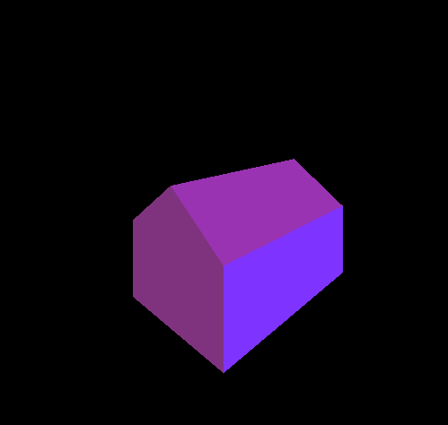

#Computer Graphics  

This is part of my extended work with Computer Graphics using JOGL in Java.  

This project aims to promotes understanding in Perspective Projection and common transformation in 3D. In this project, I transformed a home into the view from world coorindates.   

#Things you can do  
* Move the world around  
This is done by manipulating the View Reference Point (VRP) from world coorindates.  
Keys available: j,k,l,n,m,,(comma)  
* Zoom  
You can also zoom in and out. This is done by manipulating the parameters restricting the view dimension.  
Keys available: +,-  
* Rotation  
The rotations implemented are around x,y,z axis. The degree set to is currently 10, so that you can see the gradual change in angle of rotating.
Keys available: a,s,d,z,x,c  

If you are tired of transforming the house, you can also revert everything back to the start using . (period).

Here's the image of the house when you first started:

##Contact  
I can be contacted at [vu.nguyen@skidmore.edu](mailto:vu.nguyen@skidmore.edu) or [anhvu.nguyenlam@gmail.com](mailto:anhvu.nguyenlam@gmail.com).  

More information about JOGL can be found [here](http://jogamp.org/jogl/www/).
